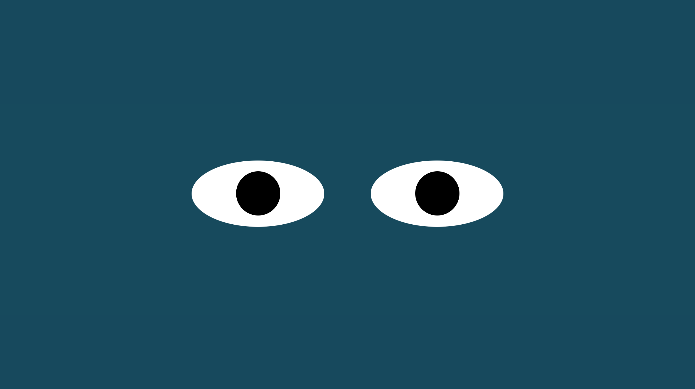

# Eye Exercise

Description:

In this exercise there is a set of eyes in the middle of the screen. Wherever we move our mouse the eyes follow us there.

How to Run:

Simply drag the Index.html file directly from the directory folder. Then you can move your mouse around to see the eyes follow it around.

Roadmap of future improvements:

I would like to make it so that the eyes are constantly changing to different colors of the rainbow. I would also like to have the eyes periodically shoot lasers so that you have to dodge them with your mouse. There could be a counter for the number of lasers that you have dodged. If your mouse gets hit by the lasers then the game resets.

License information:

MIT License

Copyright (c) 2020 John Williams

Permission is hereby granted, free of charge, to any person obtaining a copy
of this software and associated documentation files (the "Software"), to deal
in the Software without restriction, including without limitation the rights
to use, copy, modify, merge, publish, distribute, sublicense, and/or sell
copies of the Software, and to permit persons to whom the Software is
furnished to do so, subject to the following conditions:

The above copyright notice and this permission notice shall be included in all
copies or substantial portions of the Software.

THE SOFTWARE IS PROVIDED "AS IS", WITHOUT WARRANTY OF ANY KIND, EXPRESS OR
IMPLIED, INCLUDING BUT NOT LIMITED TO THE WARRANTIES OF MERCHANTABILITY,
FITNESS FOR A PARTICULAR PURPOSE AND NONINFRINGEMENT. IN NO EVENT SHALL THE
AUTHORS OR COPYRIGHT HOLDERS BE LIABLE FOR ANY CLAIM, DAMAGES OR OTHER
LIABILITY, WHETHER IN AN ACTION OF CONTRACT, TORT OR OTHERWISE, ARISING FROM,
OUT OF OR IN CONNECTION WITH THE SOFTWARE OR THE USE OR OTHER DEALINGS IN THE
SOFTWARE.
